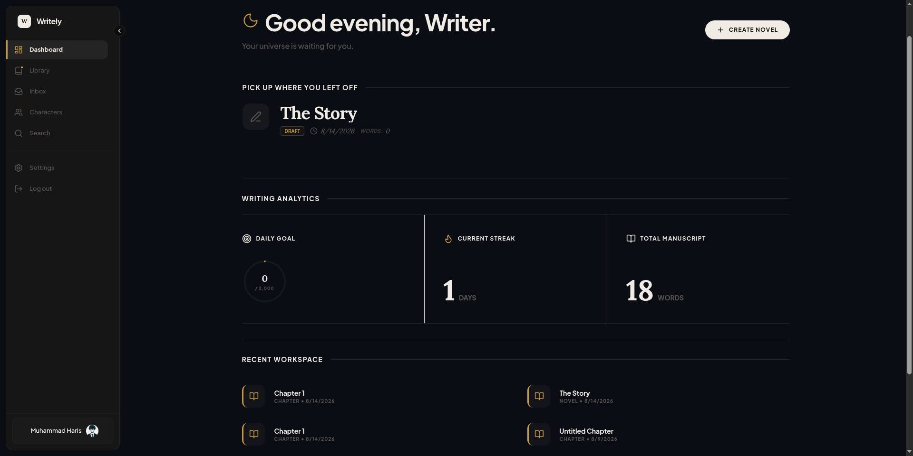

# Writely

> A focused, modular writing studio and world-building platform for novelists — draft, organize, and craft your manuscripts distraction-free.


🔗 **Repositories & Live Links**:
- 🌐 **Frontend Web App**: [https://github.com/httpsharis/writely](https://github.com/httpsharis/writely)
- ⚙️ **Backend REST API**: [https://github.com/httpsharis/writely-backend](https://github.com/httpsharis/writely-backend)
- 🚀 **Live Demo**: [https://writely-rho.vercel.app](https://writely-rho.vercel.app)

---

## Workspace Preview



---

## Overview

**Writely** is an open, feature-modular web application tailored for fiction authors and world-builders. Designed with an "editorial-first" aesthetic, it puts prose and story structure front and center while providing robust tools for manuscript organization, character management, and writing analytics.

The application uses a decoupled frontend architecture built on Next.js 16 App Router, React 19, Redux Toolkit (RTK Query), and Clerk Authentication, connecting to a dedicated REST backend API.

---

## Technical Stack

| Layer | Technology | Details |
| :--- | :--- | :--- |
| **Framework** | Next.js 16.1 (App Router) | React 19, Server & Client Components, Turbopack |
| **Language** | TypeScript 5 | Strict type definitions across models and API layer |
| **State & Data Fetching** | Redux Toolkit + RTK Query | Normalized client store and cached API queries |
| **Authentication** | Clerk (`@clerk/nextjs`) | Middleware-protected routes (`proxy.ts`), JWT Bearer tokens |
| **Editor Canvas** | Tiptap 3 (ProseMirror) | Custom `@character` mention extensions, auto-save flush, bubble menu |
| **Styling & UI** | Tailwind CSS 4 + Base UI | Dark mode support (`next-themes`), Lucide icons, Sonner toasts |
| **Monitoring** | Sentry | Performance tracking & error telemetry (`@sentry/nextjs`) |
| **DevOps & Containers** | Docker & Docker Compose | Containerized dev environment for frontend & backend |

---

## Architecture & Layout

Writely follows a **Feature-Driven Directory Architecture** to ensure clean separation of concerns, high reusability, and easy scalability for open-source contributors:

```text
writely/
├── app/                        # Next.js App Router (Routing & Layouts)
│   ├── (auth)/                 # Authentication routes (Sign-in / Sign-up)
│   ├── (dashboard)/            # Global Hub (Dashboard, Library, Characters, Settings)
│   ├── (editor)/               # Distraction-Free Workspace (`/project/[id]/write`)
│   ├── (public)/               # Reader mode & shareable public manuscript view
│   ├── layout.tsx              # Root layout & providers (Clerk, Redux, Theme)
│   └── provider.tsx            # Redux store & Sonner toast provider setup
├── features/                   # Core Domain Features
│   ├── characters/             # Character database, detail views & sidebar
│   ├── dashboard/              # Analytics, writing stats & dashboard widgets
│   ├── editor/                 # Tiptap canvas, headers, auto-save & @mention extensions
│   ├── hub/                    # Project manuscript & chapter lists
│   ├── library/                # Project grid views & library filters
│   ├── project/                # Project lobby, manuscript management & sidebar
│   └── reader/                 # Public reader canvas & navigation
├── components/                 # Shared UI Components
│   ├── shared/                 # CommandPalette, AutoSave, CharacterHoverCard, Sidebar
│   └── ui/                     # Primitives (Button, Dialog, Dropdown, Sheet, Skeleton)
├── redux/                      # Global Redux Store & API Layer
│   ├── api/                    # Base query with Clerk JWT headers (`baseQuery.ts`)
│   ├── features/               # RTK Query endpoints (documents, characters, notes, stats)
│   └── store.ts                # Redux store configuration
├── lib/                        # Client/Server utilities & image uploader
├── proxy.ts                    # Clerk authentication route guard middleware
└── docker-compose.yml          # Container orchestration (Frontend + Backend)
```

---

## Core Features

- **Tiptap Writing Canvas**: Distraction-free rich text editor with heading, blockquote, formatting shortcuts, and live word count.
- **Character Mentions & Hover Cards**: Type `@character` inside the editor to reference world entities with interactive character cards.
- **Auto-Save & Flush Guarantee**: Background debounced auto-saving with fail-safe flush triggers on component unmount and browser unload.
- **Project Lobby & Manuscript Tracking**: Organize chapters, track project completion stages (Planning, Drafting, Editing, Completed), and review novel progress.
- **Character & World Building**: Database for story characters categorized by role (Protagonist, Antagonist, Supporting, Minor) with avatars and notes.
- **Command Palette (`Cmd+K` / `Ctrl+K`)**: Rapid shortcut navigation across projects, characters, and system actions.
- **Public Reader View**: Immersive public reading canvas with custom UI shielding for shared manuscripts.

---

## Getting Started

### Prerequisites

- **Node.js**: `v18.17+` or `v20+`
- **pnpm**: `v8+` (recommended package manager)
- **Running Backend API**: Writely Backend server running on `http://localhost:4000/api` (or custom endpoint)
- **Clerk Account**: API keys from the [Clerk Dashboard](https://dashboard.clerk.com/)

### 1. Clone the Repositories

```bash
# Frontend Repository
git clone https://github.com/httpsharis/writely.git
cd writely

# Backend Repository
git clone https://github.com/httpsharis/writely-backend.git
```

### 2. Install Dependencies

```bash
pnpm install
```

### 3. Environment Configuration

Create a `.env.local` file in the project root:

```env
# Backend API URL
NEXT_PUBLIC_BACKEND_URL=http://localhost:4000/api

# Clerk Authentication
NEXT_PUBLIC_CLERK_PUBLISHABLE_KEY=your_clerk_publishable_key
CLERK_SECRET_KEY=your_clerk_secret_key

# Clerk Route Navigation
NEXT_PUBLIC_CLERK_SIGN_IN_URL=/sign-in
NEXT_PUBLIC_CLERK_SIGN_UP_URL=/sign-up
NEXT_PUBLIC_CLERK_SIGN_IN_FALLBACK_REDIRECT_URL=/
NEXT_PUBLIC_CLERK_SIGN_UP_FALLBACK_REDIRECT_URL=/
```

### 4. Run Development Server

```bash
pnpm dev
```

Open [http://localhost:3000](http://localhost:3000) in your browser.

### 5. Docker Environment Setup (Optional)

To spin up the application alongside the backend using Docker Compose:

```bash
docker-compose up --build
```

---

## Active Refactoring & Open for Collaboration 🤝

Writely is actively undergoing codebase refactoring to improve modularity, component abstraction, performance, and developer experience. **Community contributions, pull requests, and collaboration are warmly welcomed!**

### Areas Open for Contribution

- **Component Refactoring**: Decoupling complex view components into smaller, highly reusable UI primitives.
- **Test Coverage**: Adding unit & integration test suites (Vitest / React Testing Library / Playwright).
- **Editor Enhancements**: Custom Tiptap extensions (e.g. comment anchors, target word tracking, export to Markdown/EPUB).
- **Accessibility (a11y)**: Improving keyboard navigation, ARIA attributes, and focus states across all panels.
- **Performance & Caching**: Optimizing RTK Query cache strategies and optimistic state updates.

### How to Contribute

1. **Fork** the repository and create a descriptive feature branch:
   ```bash
   git checkout -b feature/your-feature-name
   ```
2. Make your changes adhering to TypeScript strict mode and the feature-driven architecture.
3. Verify linting and build checks:
   ```bash
   pnpm lint
   pnpm build
   ```
4. Open a **Pull Request** detailing your changes, rationale, and any open questions or discussion points.

---

## License

This project is under active development and open for community collaboration.
